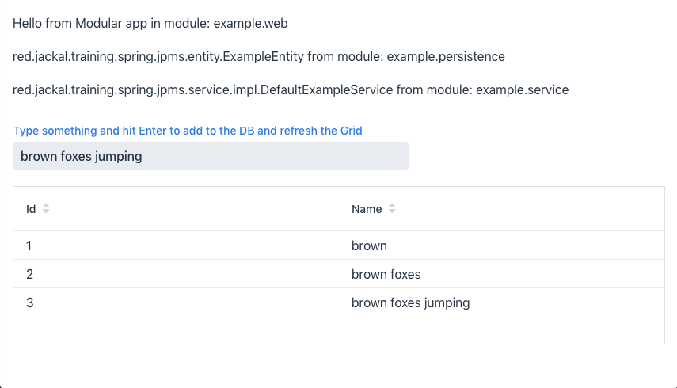
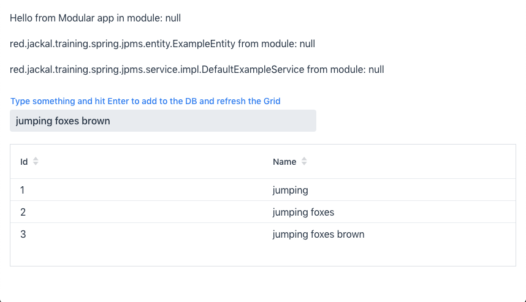

== JPMS with Vaadin

With the Java Platform Module System (JPMS) now being out for a while, a question that you might be asking yourself is: "Can Vaadin be used to make a UI for a modular application?". We've done modular applications during development time for years with other tools like Maven, however, the end result as a rule has been monolith where all modules run in one big bunch that we know as the classpath. Actually, since Java 9 all applications have run as a module, as an `unnamed module`, which essentially behaves like the good old Java classpath. This short intro will not be enough to discuss what JPMS is and how it works, rather we'll focus on actually looking into how Vaadin can be made to run in the `module-path`.

During the background research we came across an excellent JPMS starter from the Github user "qutax" https://github.com/qutax/jpms-spring-example[https://github.com/qutax/jpms-spring-example]. This starter creates a JPMS modular Spring Boot application to make a simple REST controller. This starter uses an H2 database, has a `persistence`, `service` and a `web` module, essentially a perfect little application starter. Now the question is, can we make the `web` module run Vaadin and build a UI on top of it?

=== Getting it to compile

As it turns out, there are actually surprisingly small changes that we have to do in order to accomplish this as long as we accept that the Vaadin modules will be converted to `automatic modules` rather than proper Java 9 `named modules` and accept we cannot use the Vaadin dev-mode while running the application in a modular fashion (more about that later). We can essentially copy the maven configurations from a simple Vaadin Spring boot starter https://vaadin.com/start[https://vaadin.com/start] and start defining the required dependencies in our `web` module `module-info.java` file.

```
module example.web {
    requires example.persistence;
    requires example.service;

    requires spring.boot;
    requires spring.boot.autoconfigure;
    requires spring.beans;
    requires spring.web;

    //Vaadin UI components used
    requires flow.server;
    requires vaadin.grid.flow;
    requires flow.data;
    requires vaadin.text.field.flow;
    requires vaadin.lumo.theme;
    requires vaadin.ordered.layout.flow;

    // Allow spring and Vaadin to read our web module UI packages
    opens red.jackal.training.spring.jpms.web to spring.core, spring.beans, spring.context, flow.server, vaadin.spring;
    opens red.jackal.training.spring.jpms.web.controller to spring.beans, spring.web, flow.server, vaadin.spring;
    exports red.jackal.training.spring.jpms.web to flow.server,vaadin.spring;
    exports red.jackal.training.spring.jpms.web.controller to flow.server,vaadin.spring;
}
```

As modules enforce strong encapsulation by default in JPMS, we have to state which modules our `web` module requires. Also, in order for Vaadin to be able to detect our views, we need to open and export our `web` and `web.controller` packages to both `flow-server` and since we're using Vaadin spring integration `vaadin-spring`.

After this we should be able to compile and run our application, however it doesn't quite work yet. If we try to navigate to our application will fail to load the correct client-side bundle. This is due to `flow-server` trying to load a resource from the `flow-client` module, which is not visible to `flow-server`. We could probably solve this in many ways (for instance the correct combination of `--add-opens` and `--add-reads`) however, we decided to use `--patch-module` to override a single class in `flow-server`.

The `patchflow` module contains a copy of `com.vaadin.flow.client.DefaultClientResources` which simply uses one of the classes in `flow-client` to actually fetch the resource, therefore using the correct classloader which has access to the resources in the `flow-client` module.

=== Building and running

We can now build and run our application with the following commands (from the root):

```
mvn clean package -Pproduction

cd web

java --add-modules java.instrument --patch-module flow.server=../patchflow/target/patchflow-0.0.1.jar --module-path=target/modules --module example.web/red.jackal.training.spring.jpms.web.WebApplication

```

If we then go to http://localhost:8080/[http://localhost:8080/] we should see something like this:



The example view shows which modules the various classes are loaded from so that we can verify that the runtime is actually enforcing module boundaries as well. If we wanted to, we could run the application in a single `unnamed module` to observe the difference. For this we can do the following:

```
cd ..
mvn clean install -Pproducion
cd web
mvn package -Pproduction spring-boot:repackage
java -jar target/web-0.0.1.jar
```

If we now go to http://localhost:8080/[http://localhost:8080] we should see the same application. However, if we look at the application layers at the top, we can notice that tey are not in their own named modules anymore, rather they are all in the `unnamed module`, i.e. like we're used to from good old Java. In this configuration we can even run the `web` module in Vaadin dev mode as the unnamed module exposes all jars on its classpath.



=== Try it out for yourself
So you want to play with this yourself, do you? The sources for the application discussed above are available here (licensed under `Apache 2.0`, original starter under `MIT`):

Github: https://github.com/petrixh/jpms-spring-vaadin-example[https://github.com/petrixh/jpms-spring-vaadin-example]

=== What would you use this for?

There are things that could be improved like removing the need for patching `flow-client` and adding `Automatic-module-name:` attributes to the Vaadin Jars. Are these things that would make your experience better and is it something Vaadin should focus on? Let us know in the comments section below, maybe we'll consider bringing some of these improvements to the Vaadin Core to make your life easier in the future.

=== Acknowledgements
A big part of this labs POC goes to Knut Borchers aka. "qutax" in Github who made an excellent JPMS Spring Boot starter that we were able to use and modify. His starter is available under the `MIT` license here: https://github.com/qutax/jpms-spring-example[https://github.com/qutax/jpms-spring-example]

==== DISCLAIMER
This project is experimental and you probably should not use it in production application. Vaadin does not give any warranty, support or guarantees of applicability, usefulness, availability, security, functionality, performance etc.
